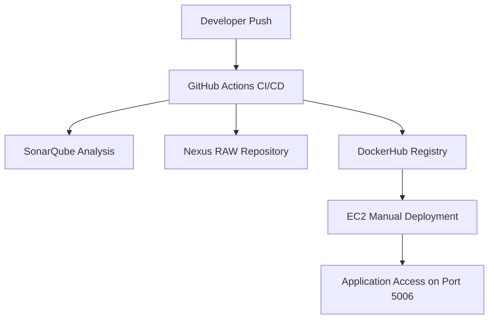

# Complete CI/CD Pipeline Documentation

---

## 📊 CI/CD Architecture Diagram (High-Level)



---

## 🏗️ Detailed Pipeline Flow Diagram

graph LR
A[Push] --> B[Actions]
B[Actions] --> C[Checkout]
C[Checkout] --> D[Install_Node_NPM]
D[Install_Node_NPM] --> E[SonarQube]
E[SonarQube] --> F[Create_TAR]
F[Create_TAR] --> G[Nexus_RAW_Upload]
G[Nexus_RAW_Upload] --> H[Docker_Build]
H[Docker_Build] --> I[DockerHub_Push]
I[DockerHub_Push] --> J[Manual_EC2_Deploy]
J[Manual_EC2_Deploy] --> K[Run_on_5006]
K[Run_on_5006] --> L[App_Live]


---

## 🏗️ Detailed Pipeline Flow Diagram

```mermaid
graph LR;
    A[Push to Main Branch] --> B[GitHub Actions Triggered];
    B --> C[Checkout Code];
    C --> D[Node.js Install & NPM Install];
    D --> E[SonarQube Scan];
    E --> F[Create TAR Artifact];
    F --> G[Nexus Upload (RAW Repository)];
    G --> H[Docker Build];
    H --> I[DockerHub Push];
    I --> J[Manual Deployment on EC2];
    J --> K[Run Container on Port 5006];
    K --> L[Application Live];
```

---

## 🖼️ Screenshots (To Be Uploaded)

Add the screenshots below when ready:

```


```

---

## 🏅 Badges (To Be Added)

Example badge placeholders:

```


```

Add real badges later once available.

--- for Node.js Application

This document provides a **fully detailed, step-by-step README.md** for your Node.js CI/CD pipeline using:

* **GitHub Actions (CI/CD)**
* **SonarQube (Code Quality Analysis)**
* **Nexus RAW Repository (Artifact Storage)**
* **Docker Image Build & Push**
* **DockerHub Registry**
* **Manual Deployment on Ubuntu EC2**

This README is suitable for GitHub and professional documentation.

---

# 📌 Project Overview

This repository contains a **Node.js application** with a complete CI pipeline configured using **GitHub Actions**. The pipeline automatically performs:

### ✔ Code Checkout

### ✔ Node.js installation (v20)

### ✔ Install dependencies

### ✔ SonarQube Code Quality Analysis

### ✔ TAR packaging

### ✔ Upload to Nexus RAW Repository

### ✔ Build Docker Image

### ✔ Push Image to DockerHub

Deployment is performed manually on EC2 using Docker commands.

---

# 🏗️ CI Pipeline Architecture

```
Developer Push → GitHub Actions CI → SonarQube → Nexus RAW Repository → DockerHub
                                                             ↓
                                                        Manual EC2 Deploy
```

---

# 🛠️ Prerequisites

Before running the pipeline, ensure you have:

### ✔ SonarQube Server

* Example: `http://<SONAR-IP>:9000`
* Token stored in GitHub Secrets

### ✔ Nexus Repository Manager (RAW hosted repo)

* Example: `http://<NEXUS-IP>:8081/repository/nodejs/`

### ✔ DockerHub Account

### ✔ EC2 Ubuntu Server (for deployment)

* Docker installed

---

# 🔐 Required GitHub Secrets

Add the following secrets under:

```
GitHub Repo → Settings → Secrets → Actions
```

| Secret Name      | Description              |
| ---------------- | ------------------------ |
| `SONAR_HOST_URL` | URL of SonarQube server  |
| `SONAR_TOKEN`    | SonarQube token          |
| `NEXUS_HOST`     | Base URL of Nexus server |
| `NEXUS_USER`     | Nexus username           |
| `NEXUS_PASS`     | Nexus password           |
| `DOCKER_USER`    | DockerHub username       |
| `DOCKER_PASS`    | DockerHub token          |

---

# 🚀 GitHub Actions CI/CD Pipeline (Full YAML)

Below is the complete working YAML file for your CI pipeline.

```yaml
ame: NodeJS CI/CD Pipeline

on:
  push:
    branches: ["main"]
  workflow_dispatch:

jobs:
  build:
    runs-on: ubuntu-latest

    steps:
    - name: Checkout Repository
      uses: actions/checkout@v4

    - name: Set up NodeJS
      uses: actions/setup-node@v4
      with:
        node-version: "20"

    - name: Install Dependencies
      run: |
        node -v
        npm -v
        npm install --no-audit --no-fund

    - name: SonarQube Scan
      uses: sonarsource/sonarqube-scan-action@v2
      env:
        SONAR_TOKEN: ${{ secrets.SONAR_TOKEN }}
        SONAR_HOST_URL: ${{ secrets.SONAR_HOST_URL }}
      with:
        args: >
          -Dsonar.projectKey=nodeapp
          -Dsonar.sources=.

    - name: Create TAR Artifact
      run: tar -czf nodeapp.tar.gz *

    - name: Upload to Nexus (RAW Repository)
      env:
        NEXUS_USER: ${{ secrets.NEXUS_USER }}
        NEXUS_PASS: ${{ secrets.NEXUS_PASS }}
        NEXUS_HOST: ${{ secrets.NEXUS_HOST }}
      run: |
        curl -v -u $NEXUS_USER:$NEXUS_PASS \
          --upload-file nodeapp.tar.gz \
          $NEXUS_HOST/repository/nodejs/nodeapp.tar.gz

    - name: Build Docker Image
      run: docker build -t ${{ secrets.DOCKER_USER }}/nodeapp:latest .

    - name: Login to DockerHub
      uses: docker/login-action@v3
      with:
        username: ${{ secrets.DOCKER_USER }}
        password: ${{ secrets.DOCKER_PASS }}

    - name: Push Docker Image
      run: docker push ${{ secrets.DOCKER_USER }}/nodeapp:latest
```

---

# 📦 Manual Deployment Instructions (Ubuntu EC2)

Once GitHub Actions pushes the image to DockerHub, log into your EC2 instance:

### 1. SSH into EC2

```bash
ssh -i yourkey.pem ubuntu@<your-ec2-ip>
```

### 2. Stop any old container

```bash
sudo docker stop nodeapp || true
sudo docker rm nodeapp || true
```

### 3. Pull latest image

```bash
sudo docker pull <your-dockerhub-username>/nodeapp:latest
```

### 4. Run container on port 5006

```bash
sudo docker run -d --name nodeapp -p 5006:5006 <your-dockerhub-username>/nodeapp:latest
```

### 5. Verify

```bash
sudo docker ps
```

### App will be available at:

```
http://<ec2-public-ip>:5006/
```

---

# 🌐 Optional: NGINX Reverse Proxy

Create config:

```
sudo nano /etc/nginx/sites-available/nodeapp
```

Add:

```nginx
server {
    listen 80;
    server_name _;

    location / {
        proxy_pass http://localhost:5006/;
        proxy_set_header Host $host;
        proxy_set_header X-Real-IP $remote_addr;
        proxy_set_header X-Forwarded-For $proxy_add_x_forwarded_for;
    }
}
```

Enable:

```bash
sudo ln -s /etc/nginx/sites-available/nodeapp /etc/nginx/sites-enabled/
sudo nginx -t
sudo systemctl reload nginx
```

Now your app loads via:

```
http://<ec2-ip>/
```

---

# 🎯 Conclusion

You now have a **complete, production-ready CI pipeline** that integrates:

* Source control
* Quality scan (Sonar)
* Artifact management (Nexus)
* Containerization (Docker)
* Registry (DockerHub)
* EC2-hosted runtime environment

# Screenshots


