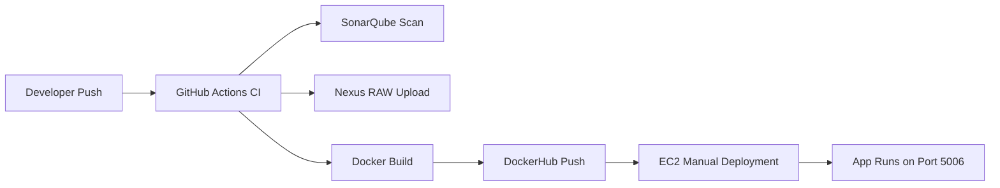

# 🚀 Complete CI/CD Pipeline Documentation (Node.js + GitHub Actions + SonarQube + Nexus + Docker + EC2)

This README provides the **complete CI/CD workflow**, from code commit → GitHub Actions → SonarQube → Nexus → DockerHub → EC2 deployment.

All instructions are written to be **production-ready**, **easy to follow**, and **resume-friendly**.

---

# 📌 Overview

This repository contains a **Node.js application** with a fully automated CI pipeline using:

* **GitHub Actions** → CI Orchestration
* **SonarQube** → Code Quality Scan
* **Nexus (RAW Repository)** → Artifact Storage
* **Docker** → Container Build
* **DockerHub** → Image Registry
* **EC2 Ubuntu** → Manual Deployment

Deployment is manual using simple Docker commands.

---

# 🧩 High-Level Architecture



---

# 🏗️ CI Pipeline Flow

```mermaid
graph LR
    A[Push] --> B[Actions]
    B --> C[Checkout]
    C --> D[Install_Node_NPM]
    D --> E[SonarQube]
    E --> F[Create_TAR]
    F --> G[Nexus_RAW_Upload]
    G --> H[Docker_Build]
    H --> I[DockerHub_Push]
    I --> J[Manual_EC2_Deploy]
    J --> K[Run_on_5006]
    K --> L[App_Live]
```



---

# 🔐 GitHub Secrets Required

Add these in:
**GitHub → Repo → Settings → Secrets → Actions**

| Secret Name      | Example          | Description        |
| ---------------- | ---------------- | ------------------ |
| `SONAR_HOST_URL` | http://<ip>:9000 | SonarQube URL      |
| `SONAR_TOKEN`    | token_here       | SonarQube Token    |
| `NEXUS_HOST`     | http://<ip>:8081 | Nexus Base URL     |
| `NEXUS_USER`     | admin            | Nexus Username     |
| `NEXUS_PASS`     | password         | Nexus Password     |
| `DOCKER_USER`    | username         | DockerHub Username |
| `DOCKER_PASS`    | token            | DockerHub Token    |

---

# 🚀 GitHub Actions CI Workflow (Full YAML)

```yaml
name: NodeJS CI/CD Pipeline

on:
  push:
    branches: ["main"]
  workflow_dispatch:

jobs:
  build:
    runs-on: ubuntu-latest

    steps:
    - name: Checkout Repository
      uses: actions/checkout@v4

    - name: Set up NodeJS
      uses: actions/setup-node@v4
      with:
        node-version: "20"

    - name: Install Dependencies
      run: |
        node -v
        npm -v
        npm install --no-audit --no-fund

    - name: SonarQube Scan
      uses: sonarsource/sonarqube-scan-action@v2
      env:
        SONAR_TOKEN: ${{ secrets.SONAR_TOKEN }}
        SONAR_HOST_URL: ${{ secrets.SONAR_HOST_URL }}
      with:
        args: >
          -Dsonar.projectKey=nodeapp
          -Dsonar.sources=.

    - name: Create TAR Artifact
      run: tar -czf nodeapp.tar.gz *

    - name: Upload to Nexus (RAW Repository)
      env:
        NEXUS_USER: ${{ secrets.NEXUS_USER }}
        NEXUS_PASS: ${{ secrets.NEXUS_PASS }}
        NEXUS_HOST: ${{ secrets.NEXUS_HOST }}
      run: |
        curl -v -u $NEXUS_USER:$NEXUS_PASS \
          --upload-file nodeapp.tar.gz \
          $NEXUS_HOST/repository/nodejs/nodeapp.tar.gz

    - name: Build Docker Image
      run: docker build -t ${{ secrets.DOCKER_USER }}/nodeapp:latest .

    - name: Login to DockerHub
      uses: docker/login-action@v3
      with:
        username: ${{ secrets.DOCKER_USER }}
        password: ${{ secrets.DOCKER_PASS }}

    - name: Push Docker Image
      run: docker push ${{ secrets.DOCKER_USER }}/nodeapp:latest
```

---

# 📦 Manual EC2 Deployment (Ubuntu)

After CI finishes, deploy manually:

### 1️⃣ Connect to EC2

```bash
ssh -i yourkey.pem ubuntu@<ec2-ip>
```

### 2️⃣ Stop old container

```bash
sudo docker stop nodeapp || true
sudo docker rm nodeapp || true
```

### 3️⃣ Pull latest image

```bash
sudo docker pull <dockerhub-user>/nodeapp:latest
```

### 4️⃣ Run container on port **5006**

```bash
sudo docker run -d --name nodeapp -p 5006:5006 <dockerhub-user>/nodeapp:latest
```

### 5️⃣ Access app

```
http://<ec2-ip>:5006/
```

---

# 🌐 Optional: NGINX Reverse Proxy (Port 80 → 5006)

Create file:

```
sudo nano /etc/nginx/sites-available/nodeapp
```

Add:

```nginx
server {
    listen 80;
    server_name _;

    location / {
        proxy_pass http://localhost:5006/;
    }
}
```

Enable:

```bash
sudo ln -s /etc/nginx/sites-available/nodeapp /etc/nginx/sites-enabled/
sudo nginx -t
sudo systemctl reload nginx
```

App becomes available at:

```
http://<ec2-ip>/
```

---

# Screenshots


